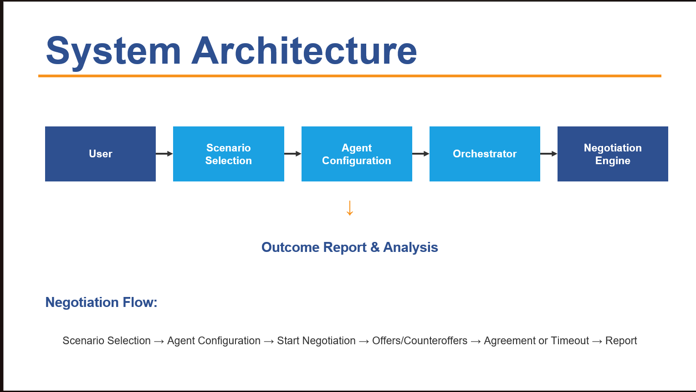

# NegoForge

> AI-Driven Multi-Agent Negotiation Training & Simulation Platform


NegoForge is a web-based multi-agent negotiation training and simulation
platform designed to provide realistic and interactive negotiation experiences
using configurable AI agents, negotiation scenarios, personalities, goals,
constraints, offers, counteroffers, concessions, and outcome evaluation.

The platform supports both **AI-vs-AI Simulation Mode** and
**Human-vs-AI Practice Mode**, allowing users to observe, participate in,
and analyze negotiation processes.

---

# Table of Contents

- [Project Overview](#project-overview)
- [Key Features](#key-features)
- [System Architecture](#system-architecture)
  - [High-Level Multi-Tier Architecture](#high-level-multi-tier-architecture)
- [Technology Stack](#technology-stack)
- [Negotiation Scenarios](#negotiation-scenarios)
- [Agent Configuration](#agent-configuration)
- [Agent Personalities](#agent-personalities)
- [Negotiation Modes](#negotiation-modes)
- [Negotiation Engine](#negotiation-engine)
- [Negotiation Workflow](#negotiation-workflow)
- [Outcome & Evaluation](#outcome--evaluation)
- [Agile Internship Documentation](#agile-internship-documentation-9-weeks--45-days)
- [Quick Start Guide](#quick-start-guide)
- [Automated Testing & Quality Assurance](#automated-testing--quality-assurance)
- [Project Directory Structure](#project-directory-structure)
- [Project Milestones](#project-milestones)
- [Future Enhancements](#future-enhancements)
- [License](#license)

---

# Project Overview

Negotiation is an important part of business operations, procurement, sales,
recruitment, project management, and strategic decision-making.

Traditional negotiation training often depends on human participants,
predefined examples, and limited opportunities for repeated practice.

NegoForge provides an interactive environment where negotiation participants
can be represented by configurable agents with different roles, objectives,
constraints, and personalities.

The platform allows users to configure negotiation scenarios, observe
AI-driven negotiation behavior, participate directly in negotiations, track
offers and concessions, and review the final negotiation outcome.

---

# Key Features

## Multi-Agent Negotiation

NegoForge models negotiation participants as independent agents.

Each agent can have:

- Role
- Goal
- Objective
- Constraints
- Personality
- Negotiation strategy
- Current position
- Negotiation history

Agents interact through offers, counteroffers, acceptances, rejections,
and concessions.

---

## AI-vs-AI Simulation

Simulation Mode allows two AI agents to negotiate automatically.

Users can observe:

- Initial offers
- Counteroffers
- Concessions
- Agent responses
- Negotiation rounds
- Negotiation history
- Final agreement
- Deadlock situations

---

## Human-vs-AI Practice

Practice Mode allows the user to participate as one of the negotiation agents.

The AI responds according to:

- Agent role
- Goal
- Personality
- Constraints
- Previous negotiation history
- Current offer
- Negotiation state

---

## Configurable Agent Personalities

NegoForge supports configurable negotiation personalities:

- Aggressive
- Collaborative
- Risk-Averse

Different personalities influence how agents approach offers,
counteroffers, and concessions.

---

## Offer and Counteroffer Management

The negotiation engine manages:

- Initial offers
- Counteroffers
- Accepted offers
- Rejected offers
- Concessions
- Current negotiation position
- Negotiation history

---

## Five-Round Negotiation Limit

Each negotiation is restricted to a maximum of **5 rounds**.

If the participants cannot reach an agreement within the allowed rounds,
the negotiation can enter a deadlock state and a mediator can be introduced.

---

## Concession Tracking

The system tracks how negotiation positions change throughout the process.

This allows users to observe:

- Initial position
- Current position
- Concessions
- Offer gap
- Negotiation progress

---

## Outcome Screen

After a negotiation is completed, NegoForge presents an Outcome Screen
containing:

- Final agreement
- Number of rounds
- Concession information
- Agent objective satisfaction
- Negotiation result
- Negotiation summary
- Transcript and history

---

# System Architecture

## High-Level Multi-Tier Architecture



NegoForge follows a modular architecture that separates the user interface,
negotiation orchestration, agent decision processing, and outcome evaluation.

### System Architecture Diagram

The detailed system architecture diagram is available in:

`docs/architecture/system-architecture.png`

---

# Technology Stack

## Frontend Technologies

| Technology | Purpose |
|---|---|
| React | User interface development |
| JavaScript | Application logic |
| Vite | Development and build tooling |
| HTML5 | Application structure |
| CSS3 | Styling and responsive interface |

## Application Architecture

| Component | Purpose |
|---|---|
| React Components | Modular user interface |
| Constants | Scenario and application configuration |
| Services | Application and negotiation logic |
| Models | Application data structures |
| Negotiation Orchestrator | Negotiation flow management |
| Decision Services | Offer and decision processing |
| Concession Tracker | Negotiation concession tracking |
| Outcome Evaluation | Negotiation result evaluation |
| LLM Integration Interface | LLM-based reasoning interface |

## Development Tools

| Tool | Purpose |
|---|---|
| Node.js | JavaScript runtime |
| npm | Dependency management |
| Git | Version control |
| GitHub | Repository hosting |
| VS Code | Development environment |

---

# Negotiation Scenarios

NegoForge currently provides three negotiation scenarios.

## Vendor Pricing Negotiation

This scenario models a negotiation between a vendor and a buyer.

Participants negotiate around:

- Product or service price
- Initial offer
- Target price
- Counteroffers
- Concessions
- Final agreement

Example negotiation:

```text
Buyer Initial Offer : ₹100,000
Vendor Counteroffer : ₹115,000
Vendor Revised Offer: ₹110,000
Buyer Counteroffer  : ₹102,100
